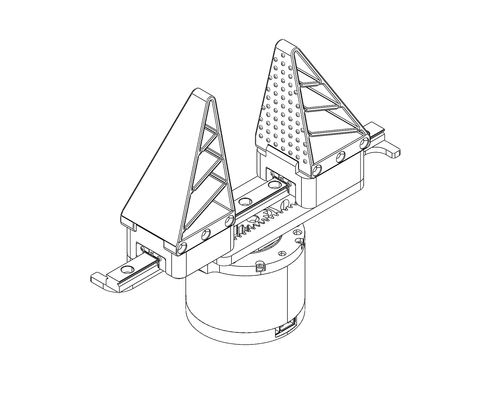
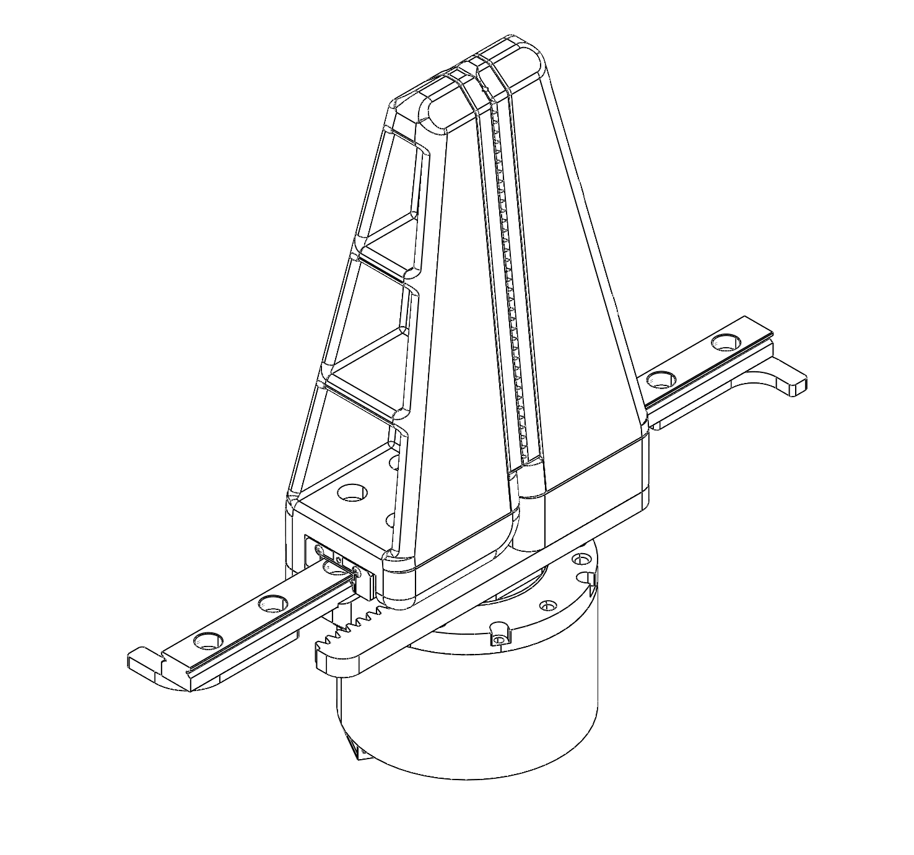

# LiberGripper_V1
A compact, single–degree-of-freedom **parallel gripper** driven by a **DM4310** actuator. **Purpose-built for robotic manipulation and grasping tasks.**  
Two interchangeable end-effector variants are provided:

- **Finned adaptive fingers** — compliant, underactuated “fin-ray” style fingers that conform to objects of varying shapes.
- **Rigid parallel fingers** — simple, stiff pads for precise, repeatable clamping.

<!-- 
 -->

<small>You can also download the 3D model here: <a href="https://grabcad.com/library/two-finger-gripper-2">GrabCAD – Two-Finger Gripper</a></small>

## Acknowledgments

Developed by Liberty Robotics – PPML-G (Perception, Planning, Manipulation & Locomotion Group).